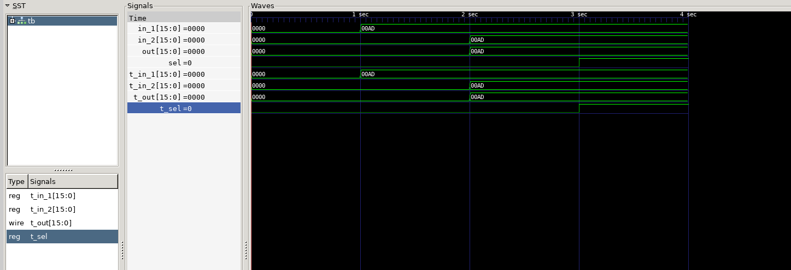

# 🎛️ 16-bit Multiplexer (MUX2) RTL Simulation

A Verilog implementation of a parameterized 2:1 multiplexer with testbench and waveform visualization.

 

## Table of Contents
- [Features](#features)
- [Prerequisites](#prerequisites)
- [Getting Started](#getting-started)
- [Project Structure](#project-structure)
- [Waveform Example](#waveform-example)
- [Troubleshooting](#troubleshooting)
- [License](#license)

## Features
- **RTL Design**: Parameterized 2:1 MUX with configurable width.
- **Testbench**: Verilog testbench with VCD waveform generation.
- **Automation**: Bash script for one-click simulation.

## Prerequisites
- **Icarus Verilog** (iverilog):  
  ```bash
  sudo apt install iverilog
  ```
- **GTKWave** (waveform viewer):  
  ```bash
  sudo apt install gtkwave
  ```

## Getting Started
1. Clone the repo:
   ```bash
   git clone https://github.com/swastim01/mux2-rtl-sim.git
   cd mux2-rtl-sim
   ```

2. Run the simulation:
   ```bash
   iverilog -o sim/mux_sim test/tb.v src/mux2.v
   vvp sim/mux_sim
   gtkwave mux2_dbg.vcd
   ```

**Optional**: Use the automation script:
```bash
chmod +x scripts/run_sim.sh
./scripts/run_sim.sh
```

## Project Structure
```
mux2-rtl-sim/
├── src/               # RTL source code
│   └── mux2.v         # 2:1 MUX design
├── test/              # Testbench
│   └── tb.v           
├── sim/               # Simulation outputs
├── scripts/           # Automation scripts
│   └── run_sim.sh     
├── .gitignore         # Ignore binaries/VCD files
└── README.md          # You are here! 
```

## Waveform Example
After running the simulation, you should see:
```
Time 0-1ns: t_out = t_in_2 (0x0)
Time 1-2ns: t_out = t_in_1 (0xAD) 
Time 2-3ns: t_out = t_in_1 (0xAD) [sel=1]
```

## Troubleshooting
- **"Command not found"**: Install [Icarus Verilog](#prerequisites) or [GTKWave](#prerequisites).
- **Missing files**: Ensure `mux2.v` and `tb.v` are in `src/` and `test/`.
- **Waveform not updating**: Clean old files with `rm sim/mux_sim mux2_dbg.vcd`.

## License
[MIT License](LICENSE) © Swasti Mishra

